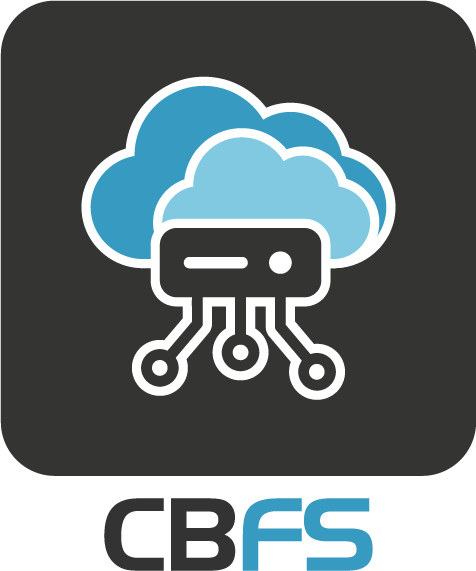

# Introduction

<figure><figcaption><p>ColdBox File System Abstraction = cbfs</p></figcaption></figure>

The `cbfs` module will enable you to abstract **ANY** filesystem within your ColdBox applications. You can configure as many disks as you wish to represent file systems in your application. Each disk is backed by a storage provider and configurable within your ColdBox application.

## Storage Providers

The available storage providers are:

* **Local** - A local file system storage provider.
* **Ram** - An in-memory file storage provider.
* **S3** - An Amazon S3, Rackspace, Digital Ocean, or Google Cloud Storage provider.

## System Requirements

* Lucee 5+
* Adobe ColdFusion 2018+
* Java 11+

## Versioning

cbfs is maintained under the [Semantic Versioning](https://semver.org) guidelines as much as possible. We number releases in the following format:

```
<major>.<minor>.<patch>
```

And constructed with the following guidelines:

* Breaking backward compatibility bumps the major (and resets the minor and patch)
* New additions without breaking backward compatibility bump the minor (and reset the patch)
* Bug fixes and misc changes bump the patch

## License

The ColdBox Platform, `cbfs` is open source and licensed under the [Apache 2](http://www.apache.org/licenses/LICENSE-2.0.html) License.

* Copyright by Ortus Solutions, Corp
* ColdBox, CacheBox, WireBox, and LogBox are registered trademarks by Ortus Solutions, Corp.

## Important Links <a href="#important-links" id="important-links"></a>

* Code: [https://github.com/coldbox-modules/cbfs](https://github.com/coldbox-modules/cbfs)
* Issues: [https://github.com/coldbox-modules/cbfs/issues](https://github.com/coldbox-modules/cbfs/issues)

## Professional Open Source <a href="#professional-open-source" id="professional-open-source"></a>


The ColdBox Security Module is a professional open source software backed by [Ortus Solutions, Corp](http://www.ortussolutions.com/services) offering services like:

* Custom Development
* Professional Support & Mentoring
* Training
* Server Tuning
* Security Hardening
* Code Reviews
* [Much More](http://www.ortussolutions.com/services)

### Discussion & Help

The Box products and modules community for discussion and help can be found here:

[https://community.ortussolutions.com/c/box-modules/](https://community.ortussolutions.com/c/box-modules/)

### HONOR GOES TO GOD ABOVE ALL <a href="#honor-goes-to-god-above-all" id="honor-goes-to-god-above-all"></a>

Because of His grace, this project exists. If you don't like this, then don't read it, it's not for you.

> "Therefore being justified by **faith**, we have peace with God through our Lord Jesus Christ: By whom also we have access by **faith** into this **grace** wherein we stand, and rejoice in hope of the glory of God." Romans 5:5
