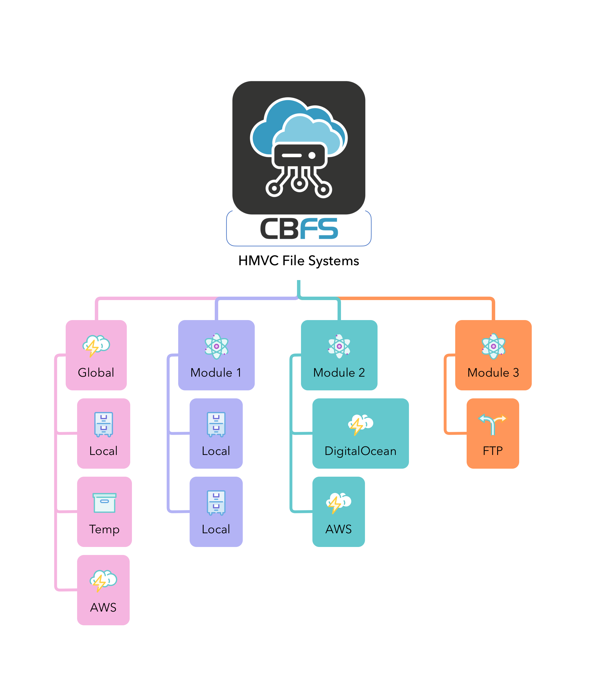

# Module Disks

<figure><figcaption>
cbfs with HVMC
</figcaption></figure>

If you are creating your own ColdBox modules, you can create disks from those modules in the `configure()` lifecycle method in the `ModuleConfig.cfc`.  You will do so by creating a `cbfs` key and adding either module `disks` or global disks.

* `disks` : The collection of disks the module collaborates.  Each name will be suffixed with the module name: `key@moduleName`
* `globalDisks` : A collection of global name spaced disks the module contributes to the entire application.

<pre class="language-javascript"><code class="lang-javascript">component {
<strong>  function configure(){
</strong>	settings = {
	  // CBFS Module
	  cbfs : {
		// Disks that will be namespaced with the module name @diskModule
		// temp@diskModule
		// nasa@diskModule
		disks : {
			"temp" : { provider : "Ram" },
			"nasa" : { provider : "Ram" }
		},
		// No namespace in global spacing
		// temp
		// nasa
		globalDisks : {
			// Should be ignored, you can't override if it exists
			"temp" : { provider : "Ram" },
			"nasa" : { provider : "Ram" }
		}
	   }
	};
  }	
}
</code></pre>
