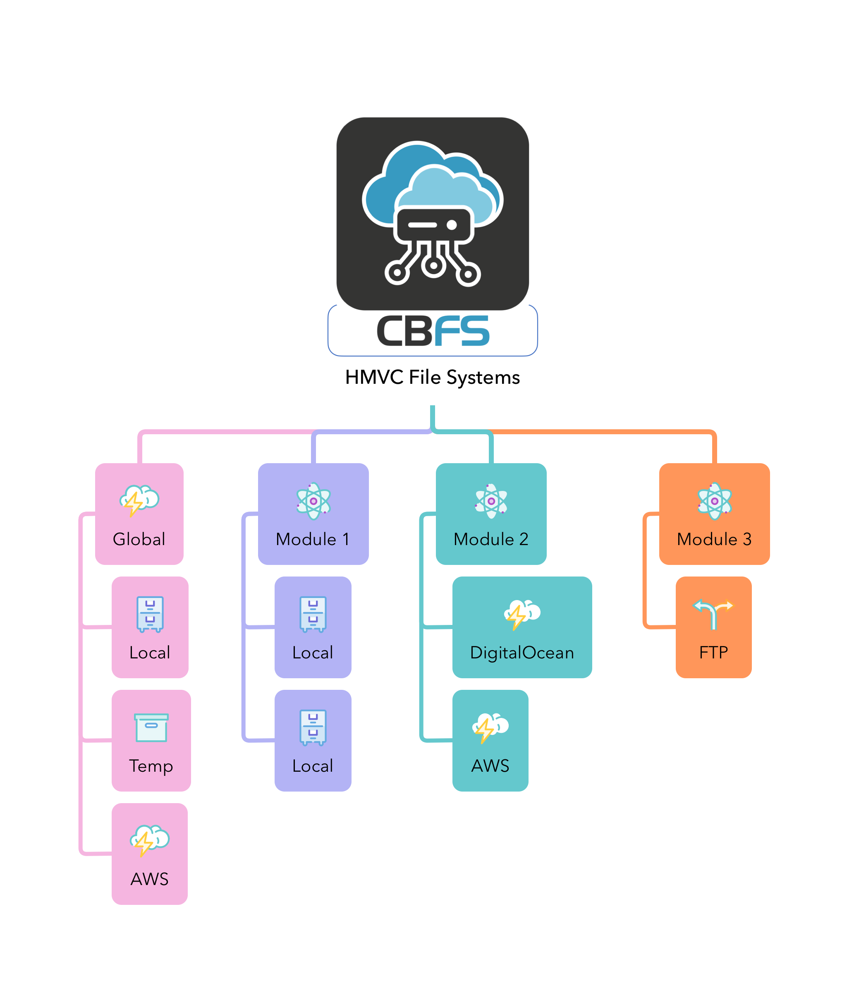

# Module Disks

<figure><figcaption><p>cbfs with HVMC</p></figcaption></figure>

If you are creating your own ColdBox modules, you can create disks from those modules in the `configure()` lifecycle method in the `ModuleConfig.cfc`.  You will do so by creating a `cbfs` key and adding either module `disks` or global disks.

* `disks` : The collection of disks the module collaborates.  Each name will be suffixed with the module name: `key@moduleName`
* `globalDisks` : A collection of global name spaced disks the module contributes to the entire application.



```boxlang
class ModuleConfig {
	function configure() {
		settings = {
			cbfs : {
				disks : {
					"temp" : { provider : "Ram" },
					"nasa" : { provider : "Ram" }
				},
				globalDisks : {
					"temp" : { provider : "Ram" },
					"nasa" : { provider : "Ram" }
				}
			}
		};
	}
}
```


```cfml
component {
	function configure() {
		settings = {
			cbfs : {
				disks : {
					"temp" : { provider : "Ram" },
					"nasa" : { provider : "Ram" }
				},
				globalDisks : {
					"temp" : { provider : "Ram" },
					"nasa" : { provider : "Ram" }
				}
			}
		};
	}
}
```


