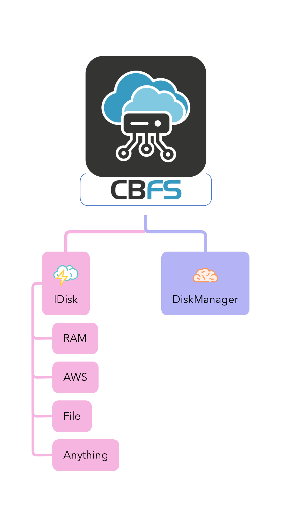

# Providers

<figure><figcaption>
The Provider Strategy Pattern
</figcaption></figure>


[local-provider.md](local-provider.md)



[ram-provider.md](ram-provider.md)



[s3-provider.md](s3-provider.md)

