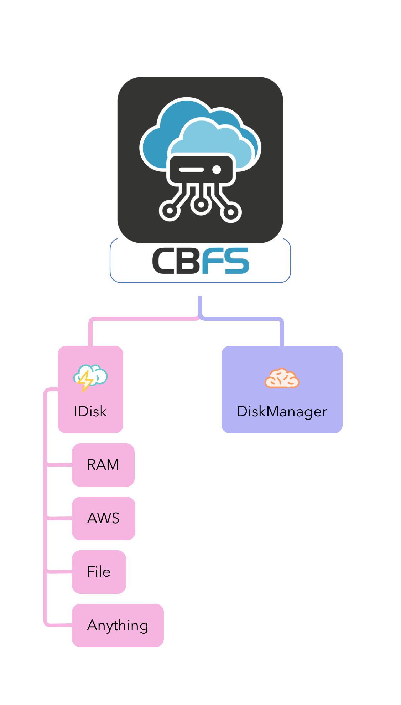

# Providers

<figure><figcaption>
The Provider Strategy Pattern
</figcaption></figure>

<table data-view="cards"><thead><tr><th></th><th></th><th data-hidden data-card-target data-type="content-ref"></th></tr></thead><tbody>
<tr><td><strong>Local Provider</strong></td><td>Store files on the local filesystem with path, upload, stream, and permission support.</td><td><a href="local-provider.md">local-provider.md</a></td></tr>
<tr><td><strong>RAM Provider</strong></td><td>Use an in-memory disk for fast ephemeral storage and isolated tests.</td><td><a href="ram-provider.md">ram-provider.md</a></td></tr>
<tr><td><strong>S3 Provider</strong></td><td>Store objects in AWS S3 and compatible services such as DigitalOcean Spaces.</td><td><a href="s3-provider.md">s3-provider.md</a></td></tr>
</tbody></table>


[local-provider.md](local-provider.md)



[ram-provider.md](ram-provider.md)



[s3-provider.md](s3-provider.md)

