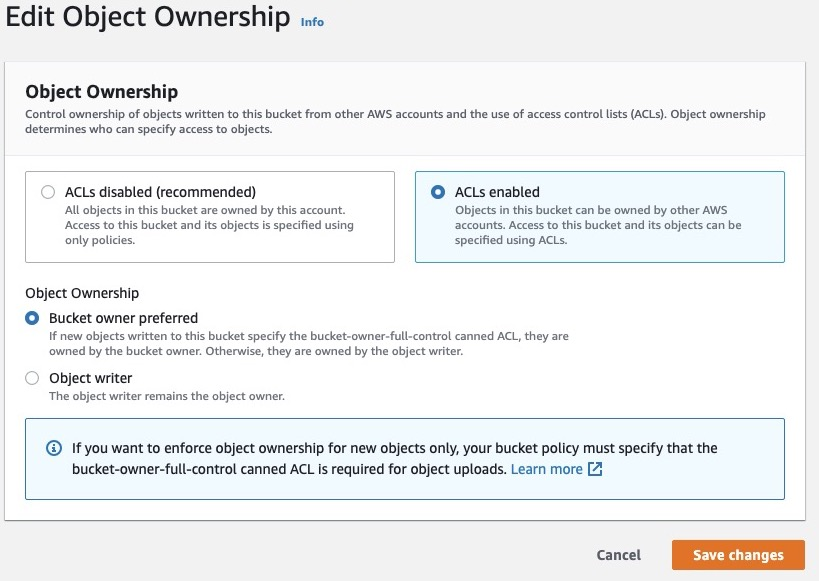
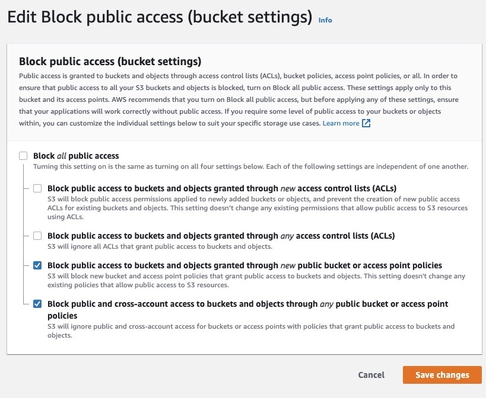

# S3 Provider

Use the S3 provider to store files within any S3 compatible file storage service such as AWS S3 or Digital Ocean Spaces.


The S3 provider uses the [s3sdk](https://forgebox.io/view/s3sdk) library for all s3 operations.



Keep in mind when using this provider that all file operations result in an outgoing network request from your application. We have utilized various caching techniques to ensure fast operations, but it's good to be mindful of these outgoing requests when working with files and folders.


## Configuration

### Example


```json
moduleSettings = {
	"cbfs": {
		// The default disk with a reserved name of 'default'
		"defaultDisk" : "myStorage",
		// Register the disks on the system
		"disks"       : {
			// Your default application storage
			"myStorage" : {
				"provider": "S3",
				"properties": {
					"visibility": "public", // can be 'public' or 'private'
					"path": "",
					"accessKey": "",
					"secretKey": "",
					"awsDomain": "digitaloceanspaces.com",
					"awsRegion": "sfo3",
					"defaultBucketName": "myDOSpace"
				}
			}
		}
	},
};
```


### Properties

This provider uses the [s3sdk](https://forgebox.io/view/s3sdk) library under the hood, and any of the properties that can be passed in are available, most of which are documented here.&#x20;

<table><thead><tr><th width="243">Property</th><th width="130">Type</th><th width="143">Default</th><th>Description</th></tr></thead><tbody><tr><td><code>autoContentType</code></td><td>boolean</td><td><code>false</code></td><td></td></tr><tr><td><code>autoMD5</code></td><td>boolean</td><td><code>false</code></td><td></td></tr><tr><td><code>accessKey</code></td><td>string</td><td>--</td><td>Your S3 access key</td></tr><tr><td><code>awsDomain</code></td><td>string</td><td>--</td><td>The domain name used to connect to your s3 service provider</td></tr><tr><td><code>awsRegion</code></td><td>string</td><td>--</td><td>The region name used to connect to your s3 service provider. Be sure your region is all lowercase, otherwise issues with pre-signed URLs can occur.</td></tr><tr><td><code>cacheLookups</code></td><td>boolean</td><td><code>true</code></td><td></td></tr><tr><td><code>debug</code></td><td>boolean</td><td><code>false</code></td><td></td></tr><tr><td><code>defaultTimeout</code></td><td>numeric</td><td>300</td><td>The default timeout of the http operations</td></tr><tr><td><code>defaultDelimiter</code></td><td>string</td><td><code>/</code></td><td>Default delimiter to use</td></tr><tr><td><code>defaultBucketName</code></td><td>string</td><td>--</td><td>The bucket name, within which this disk operates. </td></tr><tr><td><code>defaultCacheControl</code></td><td>string</td><td>no-store, no-cache, must-revalidate</td><td></td></tr><tr><td><code>defaultStorageClass</code></td><td>string</td><td><code>STANDARD</code></td><td></td></tr><tr><td><code>secretKey</code></td><td>string</td><td>--</td><td>Your S3 secret key</td></tr><tr><td><code>defaultACL</code></td><td>string</td><td><code>public-read</code></td><td></td></tr><tr><td><code>encryptionCharset</code></td><td>string</td><td><code>UTF-8</code></td><td>The encoding characterset</td></tr><tr><td><code>publicDomain</code></td><td>string</td><td>--</td><td>Will be the public domain in URLs generated - for example, when using a CDN distribution via CloudFront</td></tr><tr><td><code>retriesOnError</code></td><td>numeric</td><td><code>3</code></td><td></td></tr><tr><td><code>serviceName</code></td><td>string</td><td><code>s3</code></td><td></td></tr><tr><td><code>signatureType</code></td><td>string</td><td><code>v4</code></td><td>Which signature encoding to use, <code>v4</code> is the latest.</td></tr><tr><td><code>ssl</code></td><td>boolean</td><td><code>true</code></td><td>Use SSL for all operations</td></tr><tr><td><code>throwOnRequestError</code></td><td>boolean</td><td><code>true</code></td><td></td></tr><tr><td><code>uploadMimeAccept</code></td><td>string</td><td>*</td><td>The mime types which are accepted via the upload method. Defaults to all.</td></tr><tr><td><code>visibility</code></td><td>string</td><td>public</td><td>Whether the contents of the disk are public (world read ) or private</td></tr></tbody></table>

### Bucket Configuration Considerations

File operations, including the setting of permissions on objects within an AWS bucket require both configuration settings to the bucket and to the user account, in order to all CBFS operations.

#### User Permissions

In the IAM section of the AWS Manager, your user account should, at minimum have an ACL policy that grants them access to all S3 operations on the bucket.  Below is an example of a JSON IAM policy which grants an AWS user access to all bucket operations - including encryption and decryption if that feature is enabled on the bucket:

```
{
    "Version": "2012-10-17",
    "Statement": [
        {
            "Sid": "Stmt1412062044000",
            "Effect": "Allow",
            "Action": [
                "s3:*",
                "kms:Decrypt",
                "kms:Encrypt",
                "kms:GenerateDataKey"
            ],
            "Resource": [
                "arn:aws:s3:::my-bucket-name",
                "arn:aws:s3:::my-bucket-name/*"
            ]
        }
    ]
}
```

#### Bucket Permissions

When creating a bucket to be used with CBFS operations, some initial settings need to be configured, in order for the user you created to perform permissions operations on objects within the bucket.  For a non-root user account to perform operations, the following changes to the default configuration must be performed:

1.  Enable ACL's in the **Permissions > Object Ownership**\
    \


    <figure><figcaption></figcaption></figure>
2.  Edit **Permissions > Block Public Access** to allow the IAM users to set their own permissions on objects created. If your bucket is private this will allow the explicit settings for those objects to be peformed.\
    \


    <figure><figcaption></figcaption></figure>

Note that we have disabled the inheritance settings above, which allows new ACL policies to be created on object, but still disables any cross-account ACL settings, for security.

For public buckets, it is also recommended that you complete the Permissions > CORS section to allow access to your objects only from specific domain referrers.
